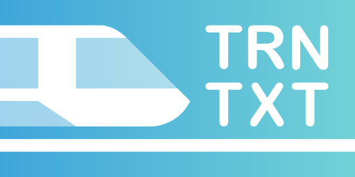

# trntxt



Pronounced "train text" and currently live at [trntxt.uk](https://trntxt.uk), this is a GPRS-friendly web service that provides train times for stations across Great Britain.

*(Also lives at [traintext.uk](https://traintext.uk), but that's not as cool)*

Uses the [National Rail 'Darwin' API](https://lite.realtime.nationalrail.co.uk/OpenLDBWS/) to get departure times.

## Usage
trntxt currently gives departure times for a given station, optionally filtered by a calling station.

Stations can be input using either their 3-letter codes or by their names (without spaces). For example, 'bristolparkway', 'bristolp' and 'bpw' will all give times for Bristol Parkway.

### Examples
* [/pad](https://trntxt.uk/pad): Departure board for London Paddington
* [/swindon](https://trntxt.uk/swindon): Departure board for Swindon
* [/bth/cardiffcentral](https://trntxt.uk/bth/cardiffcentral): List of trains from Bath Spa that call at Cardiff Central

## Development
This program will run on Node 16.

Install the required packages using `npm install` in the command line.

Transpile the source code using `npm run build`.

Tests are run with `npm run test`.

You will need to register for a National Rail API key [here](https://www.nationalrail.co.uk/46391.aspx).

Once you have a key, paste it into `./config/config.yaml`, overwriting the default value for `API_KEY`. `config.yaml` is created when you first run `npm install`.

You can run the program using `npm start`. This will lsten on port 3000 by default, so you can visit localhost:3000 on your browser. If you want to use a different port, set the environment variable `PORT`. You can do this in Bash by running `PORT=12345 npm start`. Otherwise you can overwrite the default value for `PORT` in `config.yaml`.

While developing, you might find it useful to run `npm run develop`. The server runs, then restarts/rebuilds if any of the files are changed.

### Build and run with Docker

```
docker-compose build
docker-compose up
```

### Update the list of stations

There is a script that takes the data from the autocomplete feature of the National Rail Enquiries website:

```bash
cd resources/stationFetcher
./stationFetcher.sh
```

That will update the file `stations.csv`. If it looks good, copy it to `resources/station_codes.csv`.

### To do
There are still a few things I'd like to do with trntxt. Check out the [issues page](https://github.com/danielthepope/trntxt/issues) for things to do. If you want to tackle a particular issue, let me know first in a comment or on Twitter - I might be working on it already!

## Acknowledgements
There are a number of people I'd like to thank for helping me out throughout the development of this project. The [contributors](https://github.com/danielthepope/trntxt/graphs/contributors) page doesn't tell the whole story, so here we go.

- [Tom Lane](https://github.com/tomlane), for giving a talk about Open Rail Data, planting the seed for this idea;
- [Rikki Tooley](https://github.com/rikkit), for first suggesting the idea of dynamically generated app icons;
- [Alex Birch](https://github.com/Birch-san), who helped me set up a much better way of managing the configuration files, and who submitted the first pull request to this project. However I completely mullered the PR so he didn't appear on the contributors page (sorry!);
- [Marcus Noble](https://github.com/AverageMarcus), for solving an issue I had raised just a couple of hours before;
- My brother Kieran (who doesn't own a GitHub profile - yet), who was my guinea pig for much of my Android testing;
- [Jamie Greef](https://github.com/madjam002), for his enthusiasm and for the quote "It just works";
- [Tom Wright](https://github.com/ThomWright), who helped me set up Mocha so I can prove Jamie's statement;
- And to [Jeff Schomay](https://github.com/jschomay), who although didn't contribute to the project directly, he organised the first Bristol Hack Nights, giving us developers a sociable space for us to work on our projects.
